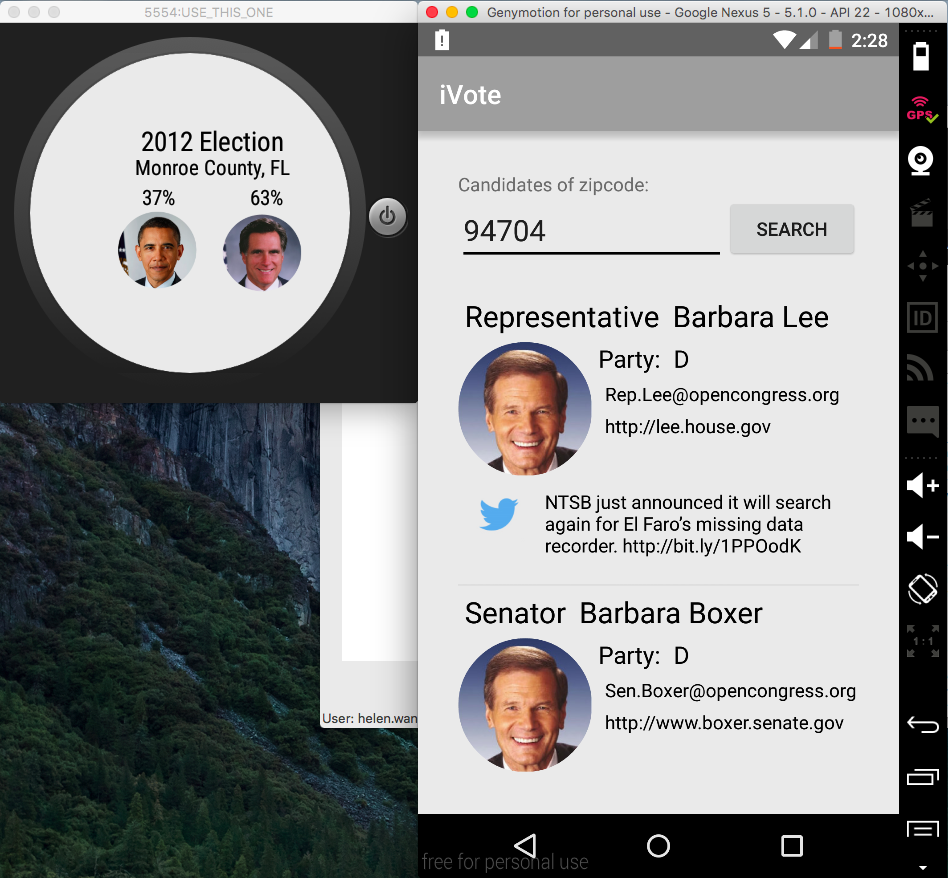
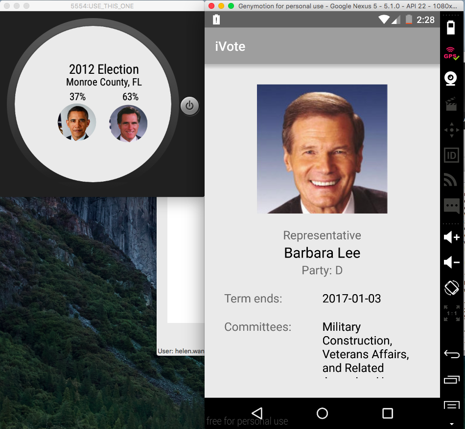

# PROG 01: Crunch Time

iVote lets users learn about the Senators and Representatives of a chosen zipcode on their phone and watch.

## Authors

Liang (Helen) Wang ([helen.wang184@berkeley.edu](mailto:your_email@berkeley.edu))

## Demo Video

See [iVote] (https://vimeo.com/157815744)

## Screenshots

## Acknowledgments

* Hat tip to anyone who's code was used
* Thank you Indragni Soft Solutions on YouTube for the WearableListView tutorial. 
* Thank you Jasper for the helpful Office Hours. 
* Thank you Claudia Nguyen for being a supportive friend. 
* Any other support

*Feel free to enhance your README. For Markdown syntax, see [the GitHub Guides](https://guides.github.com/features/mastering-markdown/). Remove this line in your submission.*
